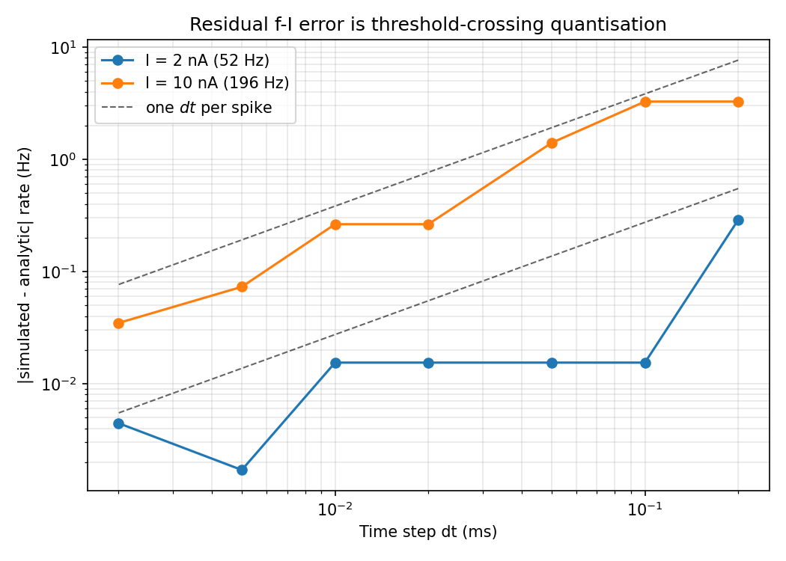
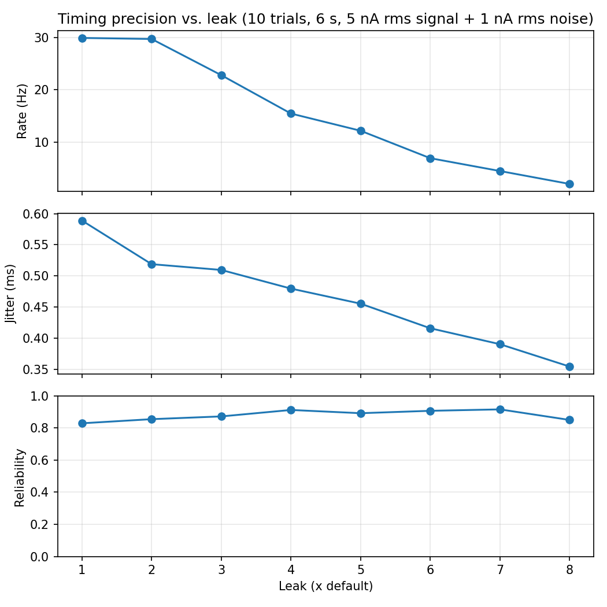
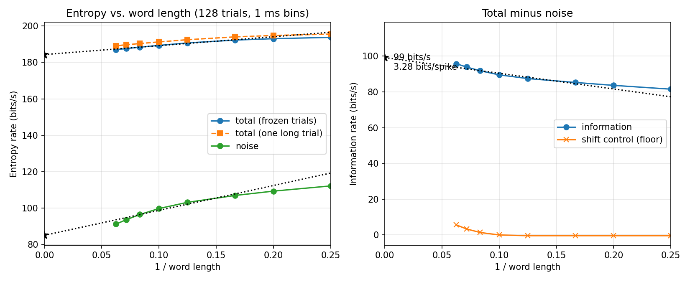

# Leaky integrate-and-fire neuron — spike timing and reliability

A MATLAB implementation of a leaky integrate-and-fire (LIF) neuron, built to study
how precisely a spiking neuron encodes a time-varying input: spike-timing jitter,
trial-to-trial reliability, and information transfer.

The model is driven by DC steps, sine waves, and band-limited ("filtered") noise,
and the simulation is validated against the closed-form firing-rate curve.

## The model

The membrane potential follows

```
tau * dV/dt = (E_rest - V) + I * R_m
```

with a hard threshold, a reset, and an absolute refractory period during which `V`
is clamped at `V_reset`.

| symbol | value | note |
|---|---|---|
| `E_rest` | -65 mV | resting potential |
| `V_thresh` | -50 mV | spike threshold |
| `V_reset` | -70 mV | post-spike reset |
| `R_m` | 10 MOhm | membrane resistance |
| `C_m` | 1 nF | membrane capacitance |
| `tau = R_m*C_m` | 10 ms | membrane time constant |
| `t_ref` | 3 ms | absolute refractory period |

Units are self-consistent throughout: I (nA) x R_m (MOhm) = mV, and MOhm x nF = ms.

The integration step is **exponential Euler**,

```matlab
V_inf = I*R_m + E_rest;
V     = V_inf + (V - V_inf)*exp(-dt/tau);
```

which is the exact solution for a current held constant across the step. This
matters: the simulated rate is already converged at `dt = 0.1 ms`, where a forward
Euler step of the same size still carries visible error.

## Validation

For a suprathreshold DC input the inter-spike interval has a closed form:

```
ISI = t_ref + tau * ln[(I*R_m + E_rest - V_reset) / (I*R_m + E_rest - V_thresh)]
```

which gives a **rheobase** (minimum current that fires the cell) of
`(V_thresh - E_rest)/R_m = 1.5 nA`, and a firing rate that saturates at
`1/t_ref = 333 Hz`.

Running `lif_fI_curve` at `dt = 0.05 ms` reproduces this to **within 1.6 Hz across
2-10 nA** — at 2 nA the simulation gives 52.0 Hz against a predicted 52.4 Hz. The
simulated cell is silent at 1.49 nA and fires at 1.51 nA, matching the analytic
rheobase, and driving it far past saturation gives 328 Hz against the 333 Hz
ceiling.

The residual error is threshold-crossing quantisation, not integration error: the
crossing is only detected at the end of a step, so each ISI is biased upward by up
to one `dt`. That is a fixed time error, so it costs proportionally more at high
rates — at 10 nA the gap shrinks from 1.4 Hz at `dt = 0.05 ms` to 0.03 Hz at
`dt = 0.002 ms`.




## Frozen-noise raster

For the timing analysis the same band-limited noise stimulus is presented on every
trial, with a small independent noise current added per trial. Spike times cluster
into repeatable "events" where the stimulus rises steeply, and smear out where it
drifts slowly near threshold.


## Jitter and reliability

Spikes pooled across trials are grouped into **events**: a peri-stimulus time
histogram bin holding at least 10% of the trials seeds an event, which is then
grown outwards over contiguous non-empty bins. For each event,

- **reliability** = fraction of trials that contributed a spike,
- **jitter** = standard deviation of the spike times within it.

An event in which any single trial fired more than once is discarded rather than
counted — its spread would measure the interval between two spikes instead of the
trial-to-trial jitter of one. Events below 50% reliability are still returned
per-event but left out of the summary means.

`lif_jitter_reliability` sweeps the leak conductance (`R_m = R_0/leak`, so
`leak = 1` is the default cell) and reports rate, jitter and reliability at each
value.

The event-finding rule is the one from Billimoria et al. (2006), lifted from an
earlier implementation. Two things were changed in the port: the "fired twice in
one event" test now uses a recorded trial index per spike rather than matching
floating-point spike times with `intersect`, and `hist` was replaced by
`histcounts`/`discretize`.

Validated against synthetic rasters with known event times, jitter and
reliability: recovered reliabilities are exact, and recovered jitter matches the
sample standard deviation of the spikes drawn into each event. Note that jitter
from 10 trials is a noisy statistic — the standard deviation of a sample standard
deviation at *n* = 10 is `sigma/sqrt(2(n-1))`, about 0.19 ms for a 0.8 ms event —
which is why the original averaged over repeated simulations.



## Information transfer

Information is total entropy minus noise entropy — the direct method of Strong
et al. (1998). The spike train is cut into bins narrow enough to hold at most one
spike, `L` consecutive bins make a binary **word**, and both quantities are the
entropy of a distribution over those words, divided by the word duration so that
they come out as rates in bits/s.

The two halves need different experiments, because they are distributions over
different things:

- **Total entropy** — the words pooled over every start time and every trial: all
  the variety the spike train is capable of. One trial of a long stimulus is
  enough, and gives the best-sampled estimate.
- **Noise entropy** — the time is held **fixed** and the words are collected
  *across trials*. Every one of them is a response to the same stimulus, so
  whatever spread they have is noise. Averaging that entropy over start times
  gives the noise entropy. This is the half that needs many trials of the same
  frozen stimulus, and the half that is identically zero when every trial is a
  copy of the last.

That distinction is the whole calculation. Pooling words over trials *and* start
times together — one `reshape` of the raster into rows — gives the total entropy,
not the noise entropy. The two happen to agree when the per-trial noise is
switched off, because then the trials are identical and pooling them adds
nothing, which is exactly the case that hides the bug.

Neither entropy has converged at any finite `L`: short words miss the
correlations between successive spikes, so both come out too high. The estimate
is the intercept of a straight line fitted in `1/L`, which is why the figure is
plotted against inverse word length.



At 30 Hz, driven by 40 Hz-band-limited noise at rheobase with 0.15 nA rms of
independent per-trial noise:

| quantity | extrapolated to 1/L -> 0 |
|---|---|
| total entropy | 184 bits/s (186 from the independent long run) |
| noise entropy | 85 bits/s |
| **information** | **99 bits/s = 3.3 bits/spike** |

### Why it can be trusted

A plug-in entropy is biased low, because a finite sample never sees every word
that could occur. That bias is worst exactly where it does the most damage: the
noise entropy is estimated from `n_trials` samples per start time — 128, against
200 000 words for the total entropy — so it is the noise entropy that comes out
too low, and a noise entropy that is too low is information that is not there.
Three things are done about it.

**The estimate is extrapolated in 1/N.** Each entropy is re-estimated on a half
and a quarter of the data and a straight line in `1/N` is extrapolated to
infinite data, as in Strong et al. It helps but does not finish the job: on a
known i.i.d. source it cuts the error at `L = 16` from 0.61 to 0.39 bits/s out
of 285.

**A shuffle control measures whatever is left.** `shift_trials` circularly
shifts each trial by a random amount, which destroys the time-locking between
trials while leaving each trial's own statistics untouched, so the true
information in the shifted raster is zero. Whatever the estimator still reports
for it is its floor. Here that floor is below 0 at `L <= 10` and reaches 3.7
bits/s at `L = 14` — a few percent of the 94 bits/s measured there, which is what
makes `L = 6..14` the range worth fitting.

**The answer is checked against the choices that went into it.** The refractory
period helps a great deal here: with a minimum interval of 7 ms and 1 ms bins,
only 5 of the 16 possible 4-bin words can occur at all, and only 53 of 65 536 at
`L = 16`, so the word distribution is far better sampled than the raw word count
suggests.

| what was varied | information |
|---|---|
| 16 / 32 / 64 / 128 / 256 trials | 110 / 105 / 103 / 102 / 101 bits/s |
| fit range `L` in [4,10] / [5,12] / [6,14] / [8,16] | 97 / 99 / 102 / 106 bits/s |
| bin width 0.5 / 1 / 2 ms | 105 / 102 / 97 bits/s |

So the trial count is converged — 128 trials is within 0.3% of 256, while 16
trials would have overstated the answer by 8% — and the residual uncertainty is
about ±5%, set by the arbitrariness of the fit range and the bin width rather
than by the simulation. The honest statement of the result is **100 ± 5 bits/s,
3.3 ± 0.2 bits per spike**.

### Validation

`check_entropy` runs the estimator on synthetic trains whose answer is known in
advance, which is the only way to tell an estimator bug from a real result:

| case | expected | measured |
|---|---|---|
| i.i.d. Bernoulli bins | `H(p)/t_bin`, the same at every `L` | within 0.39 bits/s of 285 |
| period-7 train | exactly 7 distinct words, `log2(7)` bits/word for `L >= 6` | 2.8074 vs 2.8074 |
| identical trials | noise entropy 0 | exactly 0 |
| independent trials | information 0 | the finite-trial bias, below |
| independent trials, 8 -> 512 | bias falling as `1/n_trials` | 118 -> 12.6 bits/s at `L = 12` |

The last two rows are the same statement twice: with too few trials the method
reports information where there is provably none. The shift control sees that
coming on real data — on a time-locked raster where the true information is
255 bits/s, it returns a floor of 102 bits/s at 16 trials and 33 bits/s at 128.

### Notes on the starting code

Working from `intandfire_strong.m`, besides the pooling described above:

- words were extracted with `unique(..., 'rows')` on an `n_words x L` matrix.
  Packing each word into one integer and counting runs in a sorted vector gives
  the same answer and makes the long total-entropy run practical;
- `bits(N, spike_bits) = 1` silently merges two spikes that land in one bin.
  `spike_bits` counts them and says so, since once that happens the words
  undercount spikes and both entropies come out too low;
- words were taken at every `L`-th bin. Taking one at every bin instead uses `L`
  times as much of the same data for the same stimulus; `opts.overlap` selects
  between them;
- the entropy was divided by the firing rate to get bits per spike. Both units
  are reported here, since bits/s is what the `1/L` extrapolation is linear in.

## Files

| file | what it does |
|---|---|
| `lif_params.m` | model constants, in one place so the simulation and the analytic check cannot drift apart |
| `lif_run.m` | core simulation — takes any current vector, returns `V(t)` and spike times |
| `lif_dc.m` | step response, with the measured rate printed |
| `lif_fI_curve.m` | firing rate vs. DC amplitude, with the analytic overlay |
| `filtered_noise.m` | stimulus generator: white noise, 4th-order Butterworth low-pass, scaled to a target rms with a DC offset |
| `lif_filtered_noise.m` | frozen-noise drive, spike raster across repeated trials |
| `spike_events.m` | groups spikes across trials into events; jitter and reliability per event |
| `lif_jitter_reliability.m` | jitter and reliability vs. leak conductance |
| `spike_bits.m` | binarises spike trains into the trials x bins 0/1 matrix the words are cut from |
| `spike_entropy.m` | total and noise entropy of those words, with the finite-sample correction |
| `shift_trials.m` | the shuffle control: destroys time-locking, so the information left over is the estimator's floor |
| `lif_information.m` | total entropy, noise entropy and information vs. word length |
| `make_figures.m` | regenerates the figures in `figures/` |
| `check_setup.m` | preflight: shadowed built-ins, toolbox, duplicate files on the path |
| `check_entropy.m` | checks the entropy estimator against trains whose answer is known |
| `python/` | one-for-one Python port; regenerates `figures/` without MATLAB |

## Running it

MATLAB R2020b or later. `filtered_noise.m` uses `butter` and `filtfilt` from the
Signal Processing Toolbox; `make_figures.m` uses `exportgraphics`.

```matlab
cd LIF-Research-Project
check_setup         % verify the path and toolbox first
lif_dc              % step response
lif_fI_curve        % validation against theory
lif_filtered_noise  % frozen-noise raster
lif_jitter_reliability  % jitter/reliability vs. leak
check_entropy       % validate the entropy estimator
lif_information     % total entropy, noise entropy, information (~1 min)
make_figures        % regenerate figures/
```

The figures in this README were produced by the Python port, which needs only
NumPy, SciPy and Matplotlib:

```bash
python3 python/make_figures.py
```

It reproduces every deterministic result above exactly; see
[python/README.md](python/README.md) for the comparison and for the two places
the two languages cannot agree.

## Notes on the original code

The simulation loop was rewritten from a first version that had several bugs worth
recording:

- the spike was written to `V_vect(i+1)` instead of `V_vect(i)`, leaving the true
  spike index at its initialised value of 0 mV and producing a spurious drop to
  0 mV at every spike — and growing the array past `length(t_vect)` on the last
  iteration;
- recorded spike times were offset by one step from the stimulus index;
- a `refract_flag` was set in two places and never read;
- during the refractory period `V` was left wherever it happened to be instead of
  being clamped to `V_reset`;
- the stimulus generator used `input` as a variable name, shadowing the MATLAB
  builtin.

In the rewrite the integration state is a scalar that never sees the cosmetic
spike height, so the drawn spike cannot feed back into the dynamics.

## In progress

- **A derivative-sensitive variant** of the model, to test the expectation that
  sharp upward stimulus slopes produce low-jitter, high-reliability spikes while
  slow ramps near threshold produce high jitter and dropped spikes.

## References

- Strong, S.P., Koberle, R., de Ruyter van Steveninck, R.R., Bialek, W. (1998).
  Entropy and information in neural spike trains. *Physical Review Letters* 80(1),
  197-200.
- Billimoria, C.P., DiCaprio, R.A., Birmingham, J.T., Abbott, L.F., Marder, E.
  (2006). Neuromodulation of spike-timing precision in sensory neurons. *Journal
  of Neuroscience* 26(22), 5910-5919.

## License

MIT — see [LICENSE](LICENSE).
