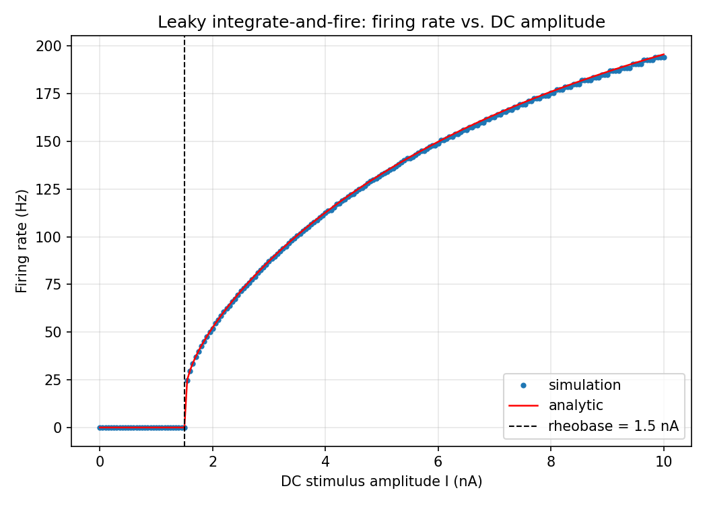
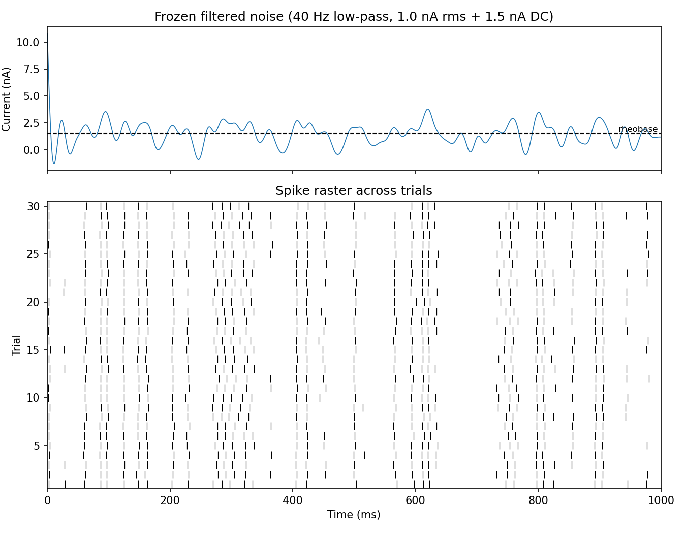

# Leaky integrate-and-fire neuron — spike timing and reliability

A MATLAB implementation of a leaky integrate-and-fire (LIF) neuron, built to study
how precisely a spiking neuron encodes a time-varying input: spike-timing jitter,
trial-to-trial reliability, and information transfer.

The model is driven by DC steps, sine waves, and band-limited ("filtered") noise,
and the simulation is validated against the closed-form firing-rate curve.

## The model

The membrane potential follows

```
tau * dV/dt = (E_rest - V) + I * R_m
```

with a hard threshold, a reset, and an absolute refractory period during which `V`
is clamped at `V_reset`.

| symbol | value | note |
|---|---|---|
| `E_rest` | -65 mV | resting potential |
| `V_thresh` | -50 mV | spike threshold |
| `V_reset` | -70 mV | post-spike reset |
| `R_m` | 10 MOhm | membrane resistance |
| `C_m` | 1 nF | membrane capacitance |
| `tau = R_m*C_m` | 10 ms | membrane time constant |
| `t_ref` | 3 ms | absolute refractory period |

Units are self-consistent throughout: I (nA) x R_m (MOhm) = mV, and MOhm x nF = ms.

The integration step is **exponential Euler**,

```matlab
V_inf = I*R_m + E_rest;
V     = V_inf + (V - V_inf)*exp(-dt/tau);
```

which is the exact solution for a current held constant across the step. This
matters: the simulated rate is already converged at `dt = 0.1 ms`, where a forward
Euler step of the same size still carries visible error.

## Validation

For a suprathreshold DC input the inter-spike interval has a closed form:

```
ISI = t_ref + tau * ln[(I*R_m + E_rest - V_reset) / (I*R_m + E_rest - V_thresh)]
```

which gives a **rheobase** (minimum current that fires the cell) of
`(V_thresh - E_rest)/R_m = 1.5 nA`, and a firing rate that saturates at
`1/t_ref = 333 Hz`.

Running `lif_fI_curve` at `dt = 0.05 ms` reproduces this to **within 1.6 Hz across
2-10 nA** — at 2 nA the simulation gives 52.0 Hz against a predicted 52.4 Hz. The
simulated cell is silent at 1.49 nA and fires at 1.51 nA, matching the analytic
rheobase, and driving it far past saturation gives 328 Hz against the 333 Hz
ceiling.

The residual error is threshold-crossing quantisation, not integration error: the
crossing is only detected at the end of a step, so each ISI is biased upward by up
to one `dt`. That is a fixed time error, so it costs proportionally more at high
rates — at 10 nA the gap shrinks from 1.4 Hz at `dt = 0.05 ms` to 0.03 Hz at
`dt = 0.002 ms`.



## Frozen-noise raster

For the timing analysis the same band-limited noise stimulus is presented on every
trial, with a small independent noise current added per trial. Spike times cluster
into repeatable "events" where the stimulus rises steeply, and smear out where it
drifts slowly near threshold.



## Files

| file | what it does |
|---|---|
| `lif_params.m` | model constants, in one place so the simulation and the analytic check cannot drift apart |
| `lif_run.m` | core simulation — takes any current vector, returns `V(t)` and spike times |
| `lif_dc.m` | step response, with the measured rate printed |
| `lif_fI_curve.m` | firing rate vs. DC amplitude, with the analytic overlay |
| `filtered_noise.m` | stimulus generator: white noise, 4th-order Butterworth low-pass, scaled to a target rms with a DC offset |
| `lif_filtered_noise.m` | frozen-noise drive, spike raster across repeated trials |
| `make_figures.m` | regenerates the figures in `figures/` |

## Running it

MATLAB R2020b or later. `filtered_noise.m` uses `butter` and `filtfilt` from the
Signal Processing Toolbox; `make_figures.m` uses `exportgraphics`.

```matlab
cd lif-neuron-model
lif_dc              % step response
lif_fI_curve        % validation against theory
lif_filtered_noise  % frozen-noise raster
make_figures        % regenerate figures/
```

## Notes on the original code

The simulation loop was rewritten from a first version that had several bugs worth
recording:

- the spike was written to `V_vect(i+1)` instead of `V_vect(i)`, leaving the true
  spike index at its initialised value of 0 mV and producing a spurious drop to
  0 mV at every spike — and growing the array past `length(t_vect)` on the last
  iteration;
- recorded spike times were offset by one step from the stimulus index;
- a `refract_flag` was set in two places and never read;
- during the refractory period `V` was left wherever it happened to be instead of
  being clamped to `V_reset`;
- the stimulus generator used `input` as a variable name, shadowing the MATLAB
  builtin.

In the rewrite the integration state is a scalar that never sees the cosmetic
spike height, so the drawn spike cannot feed back into the dynamics.

## In progress

- **Jitter and reliability** — cluster raster spikes into events, then compute
  reliability as the fraction of trials containing an event and jitter as the
  standard deviation of spike times within it.
- **Information transfer** — the direct method of Strong et al. (1998): binarise
  spike trains into words of length L, take total entropy across all trials and
  noise entropy from across-trial variability at fixed time, and take the
  difference.
- **A derivative-sensitive variant** of the model, to test the expectation that
  sharp upward stimulus slopes produce low-jitter, high-reliability spikes while
  slow ramps near threshold produce high jitter and dropped spikes.

## References

- Strong, S.P., Koberle, R., de Ruyter van Steveninck, R.R., Bialek, W. (1998).
  Entropy and information in neural spike trains. *Physical Review Letters* 80(1),
  197-200.
- Billimoria, C.P., DiCaprio, R.A., Birmingham, J.T., Abbott, L.F., Marder, E.
  (2006). Neuromodulation of spike-timing precision in sensory neurons. *Journal
  of Neuroscience* 26(22), 5910-5919.

## License

MIT — see [LICENSE](LICENSE).
